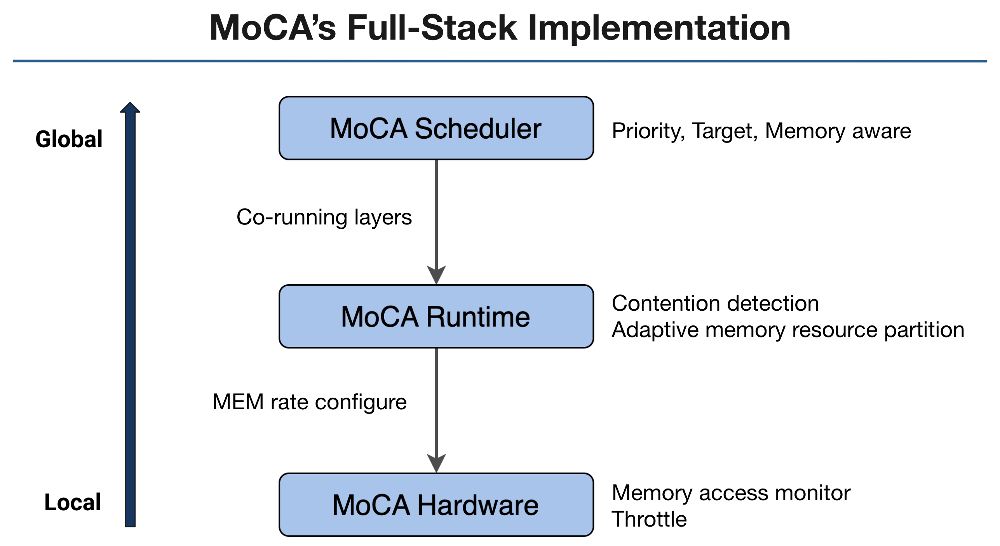
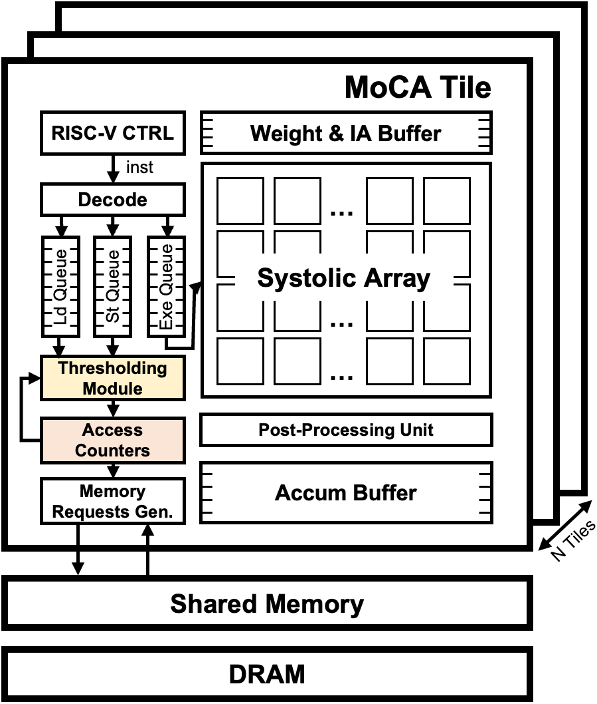

MoCA: Memory-Centric, Adaptive Execution for Multi-Tenant Deep Neural Networks 
====================================

The MoCA system is a memory-centric, adaptive system that supports efficient multi-tenancy execution for DNN accelerators.
MOCA aims to adaptively manage the system-level shared-resource contention for co-located applications by dynamically partitioning both the compute and memory resources without incurring high overhead.

This repository contains the HPCA MoCA artifact. Please refer to the appendix of the paper to run the artifacts. 
The top level FireSim environment can be obtained in the [archived repository](https://doi.org/10.5281/zenodo.7456139).
(MoCA hardware [archived repository](https://doi.org/10.5281/zenodo.7456052), MoCA software [archived repository](https://doi.org/10.5281/zenodo.7456045))

MoCA paper is published at HPCA 2023, and the paper can be found in this [link](https://hpca-conf.org/2023/main-program/).

MoCA Systems
================

MOCA is a full stack system composed of 1) a lightweight hardware memory access monitoring and regulation engine, 2) an intelligent runtime system that manages the memory usage of each of the co-located applications dynamically, and 3) a priority- and memory-aware task scheduler that selects the workloads to execute concurrently based on its user-assigned priority, latency target, and memory resource usage.



Gemmini is implemented as a RoCC accelerator with non-standard RISC-V custom instructions.
The Gemmini unit uses the RoCC port of a Rocket or BOOM _tile_, and by default connects to the memory system through the System Bus (i.e., directly to the L2 cache).


MoCA Hardware
--------------------------

MoCA hardware dynamically monitors the memory access rate of each accelerator tile and throttle its execution if the target access counts have been reached. 
MoCA hardware builds on top of the decoupled access/execute DNN accelerators and controls the memory access without changing the compute engine.



We implemented MoCA hardware on top of [Gemmini](https://github.com/ucb-bar/gemmini)
Gemmini is part of the [Chipyard](https://github.com/ucb-bar/chipyard) ecosystem, and was developed using the [Chisel](https://www.chisel-lang.org/) hardware description language.


Major hardware microarchitecture include:

* Access Counter: track memory access counts during the monitoring time ``window``

* Thresholding Module: prevent accelerator from further generating memory requests when the Access Counter value exceeds ``threshold``.

MoCA hardware engines are implemented as lightweight finite-state machines and counters without incurring significant overhead.
Two key parameters, ``window`` and ``threshold`` are configured by MoCA runtime system.


MoCA Runtime
----------------

MoCA runtime dynamically detects system-level interference and ssets limits on the accelerator's memory access rates to resolve contention if necessary.

MoCA runtime consists of two parts:
* Performance prediction of co-running layers based on available hardware resources

* Contention detection and hardware resource repartition which is activated under contention detection. 

Contention is declared if the memory bandwidth requirement of current co-running layers is greater than the available bandwidth in the system.
In that case, MoCA runtime reconfigure MoCA hardware to either limit the memory access rate by updating the parameters, ``window`` and ``threshold``.

MoCA runtime uses dynamic priority score, which considers SLA target and user-defined priority. MoCA prioritizes applicatino with higher priorities and application with less time margin to the target under contentious environment.


MoCA Scheduler
----------------
Scheduler selects co-running applications to be executed concurrently in the system. MoCA scheduler is aware of different levels of user-given priorities, latency target and different compute/memory demands of workloads.
MoCA scheduler algorithm is light-weight enough to be computed in real-time without significant overhead.

# Citing MoCA

If MoCA helps you in your academic research, you are encouraged to cite our paper. Here is an example bibtex:
```
@INPROCEEDINGS{moca-hpca,
  author={Kim, Seah and Genc, Hasan and Nikiforov, Vadim Vadimovich and Asanovic, Krste and Nikolic, Borivoje and Shao, Yakun Sophia},
  booktitle={IEEE International Symposium on High Performance Computer Architecture (HPCA)}, 
  title={MoCA: Memory-Centric, Adaptive Execution for Multi-Tenant Deep Neural Networks}, 
  year={2023},
  volume={},
  number={},
  pages={}
}
```

# Acknowledgements

- This research was, in part, funded by the U.S. Government under the DARPA RTML program (contract FA8650-20-2- 7006). This work was also supported in part by the NSF Award CCF-1955450 and in part by SLICE Lab industrial sponsors and affiliates. The views and conclusions contained in this document are those of the authors and should not be interpreted as representing the official policies, either expressed or implied, of the U.S. Government.

